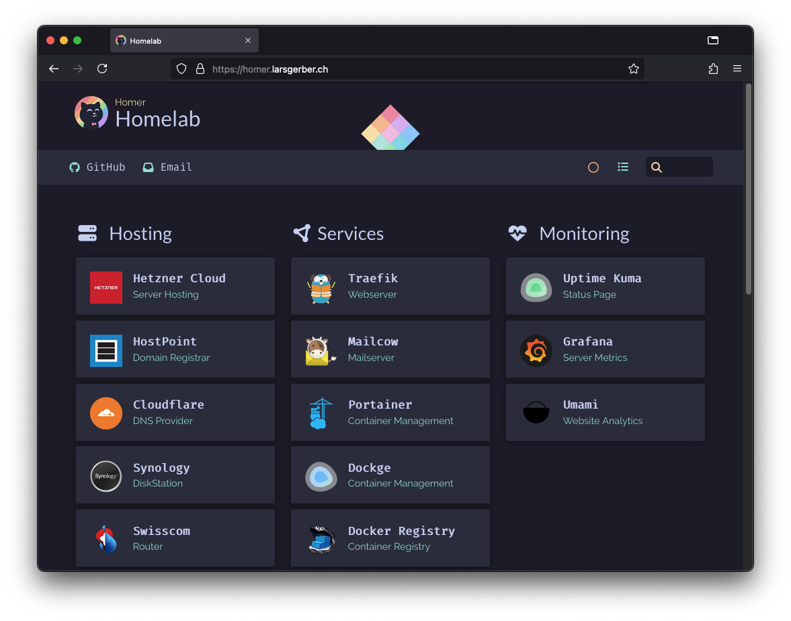

# Homer Dashboard

My simple configuration of the Homer dashboard.



Copyright Bastien Wirtz  [github.com/bastienwirtz/homer](https://github.com/bastienwirtz/homer).

Copyright Catppuccin [github.com/mrpbennett/catppucin-homer](https://github.com/mrpbennett/catppucin-homer).

&nbsp;

## Develop

```bash
docker-compose -f docker-compose.yml up
```

## Build

```bash
docker buildx build --platform linux/amd64 -f ./Dockerfile -t docker.larsgerber.ch/homer:0.0.0 .
```

## Test

```bash
docker run --rm -p 8080:8080 docker.larsgerber.ch/homer:0.0.0
```

## Push

```bash
docker push docker.larsgerber.ch/homer:0.0.0
```
12
